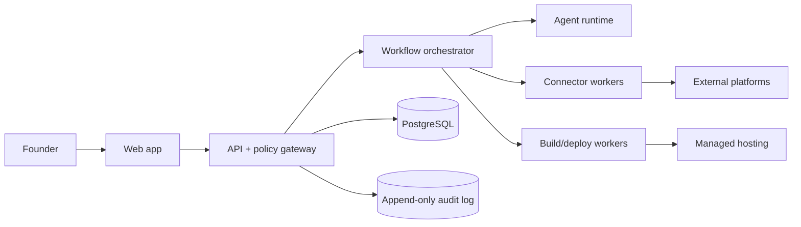

# Technical architecture

## Evidence boundary

Polsia’s FAQ documents React + Vite, Node.js/Express, PostgreSQL, and Render hosting. That is first-party documentation only; it does not prove the private production topology. The architecture below is a recommended comparable-platform design.

## Context

## Recommended components

- **Web:** React/Vite or Next.js shell with server-sent progress updates; route guards by company and role.
- **API:** Node.js/TypeScript service (Express-compatible) for CRUD, policy checks, approvals, and signed job submission.
- **Workflow:** durable queue/workflow engine with step checkpoints, deduplication keys, retries, timeouts, dead letters, and compensation actions.
- **Agent runtime:** planner → specialist workers → reviewer; each step receives a narrow tool contract, tenant context, budget, and evidence requirements.
- **Data:** PostgreSQL for normalized tenant data; object storage for artifacts; vector/search index only for user-approved company memory.
- **Secrets:** KMS-backed secret store; envelope encryption; short-lived connector tokens; redaction at ingestion and logging.
- **Build/deploy:** isolated build workers, dependency and secret scanning, preview environment, immutable artifact, health check, canary/rollback.
- **Connectors:** OAuth token broker plus provider-specific workers; read/write scopes separated; webhook verification and polling fallback.
- **Observability:** structured traces with `tenant_id`, `company_id`, `workflow_id`, `task_id`; content redaction and retention policy.

## Control planes

1. **Experience plane:** dashboard, chat, documents, approvals, billing views.
2. **Execution plane:** workflows, task queue, agents, connectors, build/deploy workers.
3. **Trust plane:** policy engine, consent, approvals, audit, budgets, isolation, retention.
4. **Control plane:** platform operations, model/provider configuration, quotas, incidents, support tools.

## Security and isolation

Every request resolves a user, tenant, company, and role before data access. Row-level authorization is enforced in the API and database. External side effects require a policy decision plus idempotency key. Logs store references and hashes rather than message bodies or secret values. Exports are signed and time-limited. Deletion is staged: disable execution, revoke tokens, retain legally required audit records, then purge according to policy.

## Reliability model

Onboarding and operating cycles are sagas. Each step is idempotent and records input/output references. A failed step exposes safe retry, support context, and compensation status. External writes use an outbox and provider receipt; replay never repeats a confirmed side effect.
