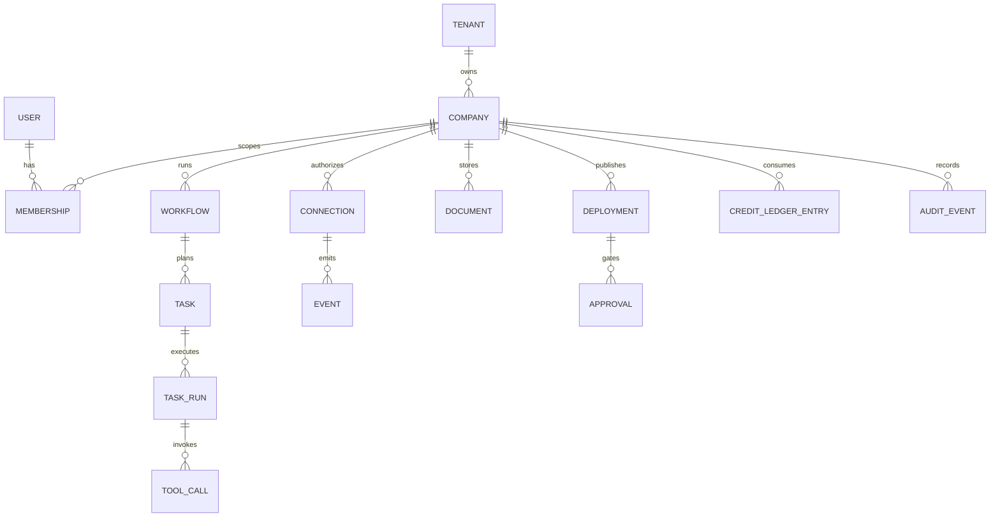

# Conceptual data model

## Core entities

- **User/Tenant/Membership:** identity, billing owner, company-scoped role, invite and revocation state.
- **Company:** brief, lifecycle (`provisioning`, `active`, `paused`, `deactivated`, `deleting`), plan, policy profile, locale.
- **Workflow:** onboarding, operating cycle, task plan, or deployment; status, checkpoints, budget, model/provider, trace.
- **Task/TaskRun:** user-visible intent, type, priority, schedule, state, approval requirement, run attempts, result references.
- **ToolCall:** allowlisted action, arguments hash, policy decision, approval token, provider receipt, idempotency key.
- **Connection:** provider/account, OAuth scopes, encrypted token reference, health, last sync, consent, disconnect timestamp.
- **Event:** normalized provider event, source cursor, dedupe key, timestamp, sensitivity, evidence references.
- **Document:** mission, roadmap, research, brief, report, or artifact; version, author/agent, provenance, visibility.
- **Deployment:** source revision, artifact, environment, URL, health, version, rollback parent, secrets revision.
- **Approval:** requested action, risk class, diff/preview, requester, approver, expiry, decision, execution receipt.
- **CreditLedgerEntry:** grant/spend/refund/expiry, amount, permanence, source task, balance snapshot, billing period.
- **AuditEvent:** append-only record for authentication, policy, tool, state, billing, consent, and external side effects.

## Invariants

1. Every company-owned row has exactly one `company_id`; membership is required for access.
2. A task run cannot enter `executing` without a current policy decision and sufficient budget.
3. A tool call with an external write must have a unique idempotency key and provider receipt.
4. An approval is bound to a content hash, scope, company, actor, and expiry; edits invalidate it.
5. Credit balance is derived from an append-only ledger, never edited in place.
6. Connector tokens and secret values are never returned by ordinary read APIs.
